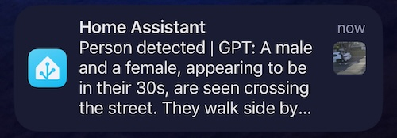
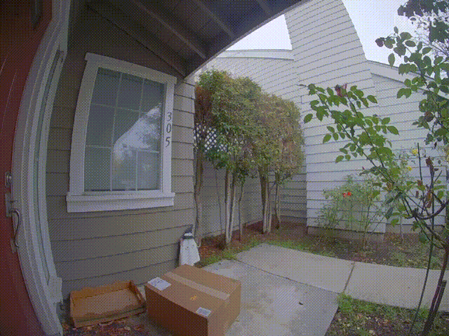
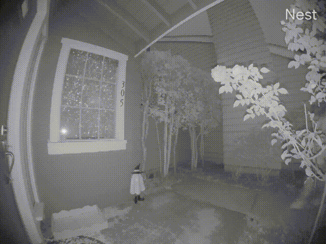
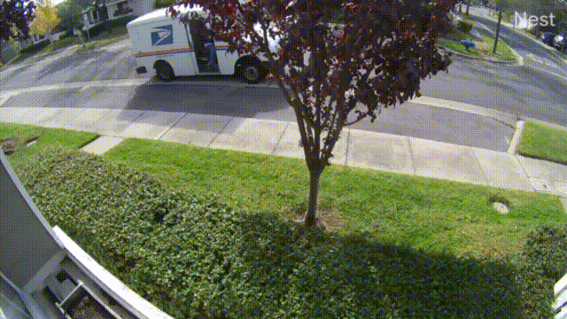

# AmbleGPT

Video surveilance footage analyst powered by GPT-4 Vision.

## Summary

AmbleGPT is activated by a Frigate event via MQTT and analyzes the event clip using the OpenAI GPT-4 Vision API. It returns an easy-to-understand, context-rich summary. AmbleGPT then publishes this summary text in an MQTT message. The message can be received by the Home Assistant Frigate Notification Automation and sent to a user via iOS/Android notifications.

**⚠️ Warning: this repo is under active development. Please expect bugs and imperfections. You're welcome to submit issues.**


## Recent Updates
* An option for less verbose summary: see `verbose_summary_mode` below (2023-11-30)
* Use ffmpeg (if available) for sampling video . Thanks @skrashevich for the contribution (2023-11-30)


## Demo




More video examples:

| Video        | GPT Summary    |       
| ------------- |:-------------:|
|          | Suspicious: A man appeared, approached a package left outside, picked it up, and walked away. This could indicate a potential package theft, as the person showed no signs of verifying address or ownership before taking the package.|
|    | Suspicious: A person wearing a hoodie and a mask is seen approaching, standing by, and then walking away from the front door of a house. The person is carrying a bat and the scene takes place during nighttime, which is suggestive of suspicious or potentially criminal activity.|
|       | A delivery man, approximately 35 years old, approached the door and placed a package down. He briefly interacted with a mobile device before leaving the scene. |
|       | A female, approximately 30 years old and 1.65 meters tall, is seen approaching and standing at the front door, looking down momentarily and then preparing to interact with the person who might open the door |
|       | A postal worker (in a blue uniform) was seen exiting a delivery vehicle and walking off-screen, presumably to deliver mail or a package. |
|          | A male and a female, appearing to be in their 30s, are seen crossing the street from the left to the right. They walk side by side and are visible for a total of 18 seconds.|


## Prerequisites 

* Frigate https://github.com/blakeblackshear/frigate
  * Currently Frigate is the only supported NVR. 
   
* Frigate <> Home Assistant Integration: https://docs.frigate.video/integrations/home-assistant
  * To receive notifications which contain the AmbleGPT generated event analysis.

* MQTT Broker
  * You may already have one when setting up Frigate.


## Supported Platforms

* amd64
* arm64

## Installation

### Preparation

AmbleGPT requires the OpenAI API currently, and you'll need to set it up using your own OpenAI API key, which incurs some cost. For example, to process a 30-second video clip, with a sampling rate of one frame every 3 seconds, yielding 10 frames in total, the cost is 0.01 USD as of today 2023-11-16.

The tutorial of getting your OpenAI API key can be found [here](https://www.howtogeek.com/885918/how-to-get-an-openai-api-key/).


### Configuration
Set your API key as an environment variable
```shell
export OPENAI_API_KEY=YOUR_KEY_HERE
```

Create `config.yml` with the following values. Remember to change `YOUR_FRIGATE_IP` and `YOUR_FRIGATE_IP`.
```yaml
frigate_server_ip: YOUR_FRIGATE_IP
frigate_server_port: 5000
mqtt_broker: YOUR_MQTT_BROKER_IP
mqtt_port: 1883
result_language: english # optional
mqtt_username: YOUR_MQTT_USER # optional
mqtt_password: YOUR_MQTT_PASSWORD # optional
verbose_summary_mode: false #optinal, default true
prompt: > #optional
   If necessary, uncomment this and use your prompt here
   The default prompt can be found in mqtt_client.py

per_camera_configuration: #optional
  # The camera name must match Frigate
  Front Door:
    # The custom prompt is optional and is used to provide more context for GPT to better understand the footage.
    # This will be inserted into the prompt before sending it to GPT.
    custom_prompt: >
      The camera that took the footage is a doorbell camera outside the front door of the house.
      The door is on the left side of the video frame and the exit is on the right side.
  Outside:
    custom_prompt: >
      The camera that took the footage is mounted on the frame of the front window of the house facing the street.
      The street allow guest parking and it is normal to see cars parked on the street.
      There might also be people walking (with their dogs) on the sidewalk before 9pm.
```

### Run AmbleGPT
Docker is recommended.

Make sure to change `/path/to/your/config.yml` and `YOUR_OPENAI_API_KEY` in the command below.
```shell
docker run --detach --name amblegpt \
    --restart unless-stopped \
    -e OPENAI_API_KEY="$OPENAI_API_KEY" \
    -v /path/to/your/config.yml:/app/config.yml \
    ghcr.io/mhaowork/amblegpt
```

Alternatively, you can simply install deps in `requirements.txt`, set `.env` and run `mqtt_client.py`.


### Frigate Notifications via Home Assistant Blueprint

Import this Blueprint: https://github.com/mhaowork/HA_blueprints/tree/main

If you already have SgtBatten/HA_blueprints, you will need to manually edit its YAML in Home Assistant following [this guide](https://www.home-assistant.io/docs/automation/using_blueprints/#keeping-blueprints-up-to-date) and  copy [this file](https://github.com/mhaowork/HA_blueprints/blob/main/Frigate%20Camera%20Notifications/Stable) over. This new file contains a new subscriptoin to AmbleGPT's MQTT messages and inserts GPT generated summaries in notifications.


**That's it for the installation!**

Note, the processing time for each video clip, which includes decoding and processing, varies based on the CPU speed of your host machine and OpenAI API round-trip time. So in reality, you will see one notification first which includes the usual static message like "Person Detected - Front camera". Then after a delay, the notification text will update automatically to show the AmbleGPT summary.


## Future Work
1. ~Allow easier prompt customization~
2. ~Custom prompts per camera to allow GPT to understand the angle and context of each camera.~
3. Further reduce # of tokens required to process a clip
