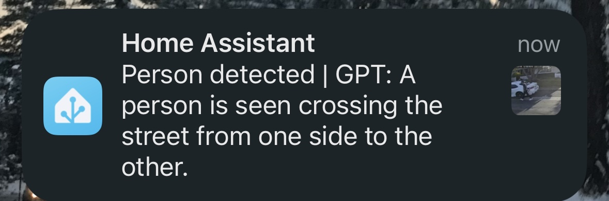

# AmbleGPT

Video surveilance footage analyst powered by GPT-4 Vision.

## Summary

AmbleGPT is activated by a Frigate event via MQTT and analyzes the event clip using the OpenAI GPT-4 Vision API. It returns an easy-to-understand, context-rich summary. AmbleGPT then publishes this summary text in an MQTT message. The message can be received by the Home Assistant Frigate Notification Automation and sent to a user via iOS/Android notifications.


## Demo




More examples:
Video:

| Video        | GPT Summary    |       
| ------------- |:-------------:|
|       | A female, approximately 30 years old and 1.65 meters tall, is seen approaching and standing at the front door, looking down momentarily and then preparing to interact with the person who might open the door |


## Features

**Configurable Prompts**
You will be able to update the prompt to fit your specific needs – simply ask the analyst using natural language!

For example, the default prompt (#TODO add link to prompt) attempts to estimate the number of humans detected, as well as their age, height, and gender.


video_file_two_persons_walking_street
```
A male and a female, appearing to be in their 30s, are seen crossing the street from the left to the right. They walk side by side and are visible for a total of 18 seconds."

```

**Image Compression to Reduce API Cost**

OpenAI charges by tokens, which in this case are pixels. This project resizes the footage to help you save on API costs.


## Prerequisites 

* Frigate https://github.com/blakeblackshear/frigate
  * Currently Frigate is the only supported NVR. 
   
* Frigate <> Home Assistant Integration: https://docs.frigate.video/integrations/home-assistant
  * To receive notifications which contain the AmbleGPT generated event analysis.


## Installationo

### Preparation
0. AmbleGPT utilizes the OpenAI API, and you will need to configure it with your own OpenAI API key. See the OpenAI API cost section (#TODO) to understand the financial implications.

1. Clone this repository and create your `.env` file for configurations in the folder. You can copy the existing example file like below:
    ```shell
    cp .env.example .env
    ```
    In this file, you will need to set your OpenAI API key and specify Frigate and MQTT IP addresses and ports (if not using the default values).

### Run AmbleGPT
Docker or Docker Compose is recommended.


* Docker
    ```shell
    docker run -d -p 1883:1883 #TODO add docker image #skrashevich/double-take:latest
    ```

* Docker Compose
    ```shell
    docker-compose up -d
    ```


Alternatively, you can simply install deps in `requirements.txt` and run `mqtt_client.py`.


### Frigate Notifications via Home Assistant Blueprint

#TODO Add blueprint notif instructions
